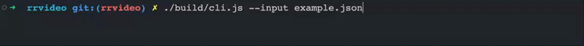

# @dom-replay/video

`@dom-replay/video` transforms a recorded `dom-replay` session (events JSON) into a video.



## Install

1. Install [Node.JS](https://nodejs.org/en/download/)。
2. Run `npm i -g @dom-replay/video` to install the CLI.

## Usage

### Transform a session (JSON) into a video

```shell
dom-replay-video --input PATH_TO_YOUR_EVENTS_FILE
```

Running this command will output a `dom-replay-video-output.webm` file in the current working directory.

### Config the output path

```shell
dom-replay-video --input PATH_TO_YOUR_EVENTS_FILE --output OUTPUT_PATH
```

### Config the replay

You can prepare a player config file (see example below) and pass it to the CLI.

```shell
dom-replay-video --input PATH_TO_YOUR_EVENTS_FILE --config PATH_TO_YOUR_CONFIG_FILE
```

You can find an example config file [here](./dom-replay-video.config.example.json).
